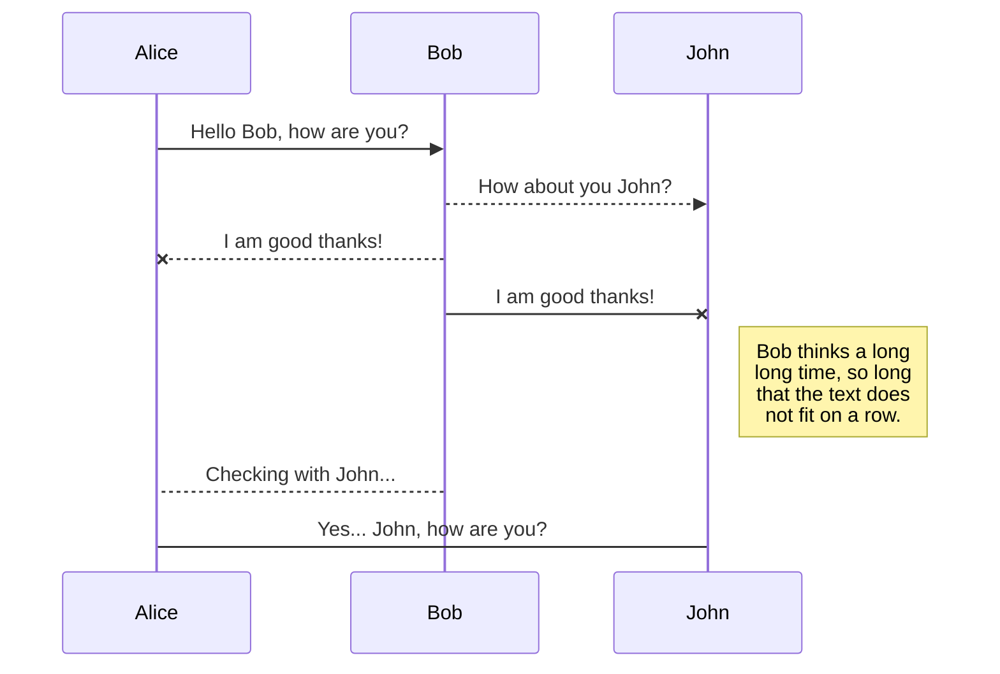
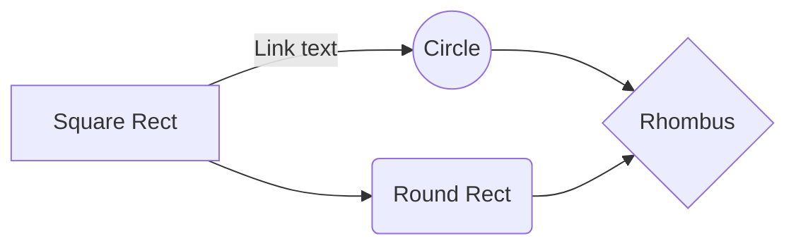

# Sprint 2 Robot Documentation

- Version 0.0.1
	- My [NF] first attempt at documenting the mechanical, electrical and software aspects of Sprintbot, from a Theme 3 perspective. 

## Sprint 2
Sprint 2 was a 4 week long (26th Feb - 24th March 2020) hardware focused sprint, starting with a 2 day meeting and ending with a single day integration push, both at ICAIR. 
Due to the Covid-19 pandemic the end of the sprint was postphoned until access to campuses was partically restored (October 2020).
The briefing document is [here](https://drive.google.com/drive/folders/1twYxoXcRTZItLzTB_jrvbxy3_hq5Eg7F)

## Nomenclature
The robot developed in Sprint 2 of the Pipebots project may be refered to as _SprintBot_ or colloquially _BigBallBot_ 
>Note: Some members call it _Sprintbot-2_ which maybe confusing as this was the first robot developed in a sprint, but was undertaken in the second sprint event of the project. 

# Hardware
### To Do
- Add Solidworks file
- Add Folder of final STLs
- Add images here inc initial one

During the initial meeting a conceptual design was agreed upon. The robot was to be ball shaped to allow it to fit into pipes and go around corners while maximising the internal space avaliable for payloads. 

*The initial Concept*

# Software
## Robot Firmware
## Android App
# Electronics
## T3 Essentials
## Other Theme Payloads

## UML diagrams

You can render UML diagrams using [Mermaid](https://mermaidjs.github.io/). For example, this will produce a sequence diagram:

And this will produce a flow chart:

<!--stackedit_data:
eyJoaXN0b3J5IjpbMTE5OTYzMDUzNSwxMzYwNjA2NF19
-->